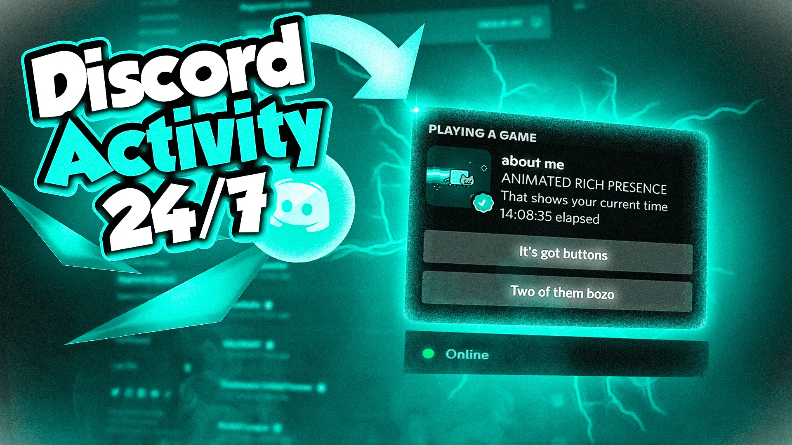

# Discord 24/7 Rich Presence

> Keep your Discord account **online 24/7** with custom **Rich Presence**!. Show games, music, or any activity—even when you're AFK. Lightweight and simple to use!



---

## 🚀 Features

- ✅ Stay **online 24/7** on Discord
- 🧠 Show **custom Rich Presence** (game titles, status, timestamps)
- 💻 Cross-platform: **Windows, macOS, Linux**
- 🔒 Lightweight and safe (no automation/selfbot)
- ⚙️ Configurable via JSON file

---

## 🛠️ Setup

1. **Clone the repo**

```bash
git clone https://github.com/nexoscreation/discord-24-7-rich-presence.git
cd discord-24-7-rich-presence
```

2. **Install dependencies**

```bash
npm install
```

3. **Edit your config**

- Open `.env` and set your account token.

```env
TOKEN=XXXXXXXXXXXXXXXXXXXXXXXXXXXXXXXXXXX
```

- Open `config.yml` and set your Rich Presence data.

4. **Run the code**

```bash
npm run start
```

---

## 🔧 Example `config.yml`

```yml
application_id: "1311204057490259979"

# Activity type: 0 = Playing, 2 = Listening, 3 = Watching
type: 3

name: "Github"
details: "Watching Github"
state: "Star Repo"

# Images
largeImageKey: "1377844502521446490"
largeImageText: "Watching Github"
smallImageKey: "1377845999464087653"
smallImageText: "Star Repo"

# URL (optional, works only with certain types)
url: "https://www.example.com/"

# Buttons (optional)
buttons:
  - name: "Visit Website"
    url: "https://www.example.com"
  - name: "GitHub Repo"
    url: "https://github.com/"

# Custom status
custom_status: "Watching you"
custom_emoji: "🔥"
```

---

## 🤝 Contributing

We ❤️ contributions! Follow these steps to contribute:

1. 🍴 **Fork** the repository
2. 🌿 **Create** a new branch (`git checkout -b feature/AmazingFeature`)
3. 💾 **Commit** your changes (`git commit -m 'Add some AmazingFeature'`)
4. 🚀 **Push** to the branch (`git push origin feature/AmazingFeature`)
5. 🔃 **Open a Pull Request**

---

## ❗ Disclaimer

This is for **educational use only**. Misuse can lead to **Discord account restrictions**. Avoid using user tokens or automating user actions.

---

## 📄 License

This project is licensed under **The UnLicense** See the [LICENSE](LICENSE) file for details.

---

## 📬 Contact & Community

💬 Join us on **Discord**: [Click Here](https://discord.gg/H7pVc9aUK2)  
🐦 **Follow on Twitter**: [@nexoscreation](https://twitter.com/nexoscreation)  
📧 **Email**: [contact@nexoscreation.tech](mailto:contact@nexoscreation.tech)

<p align="center">
  Made with ❤️ by <a href="https://github.com/nexoscreation">@nexoscreation</a>
</p>
